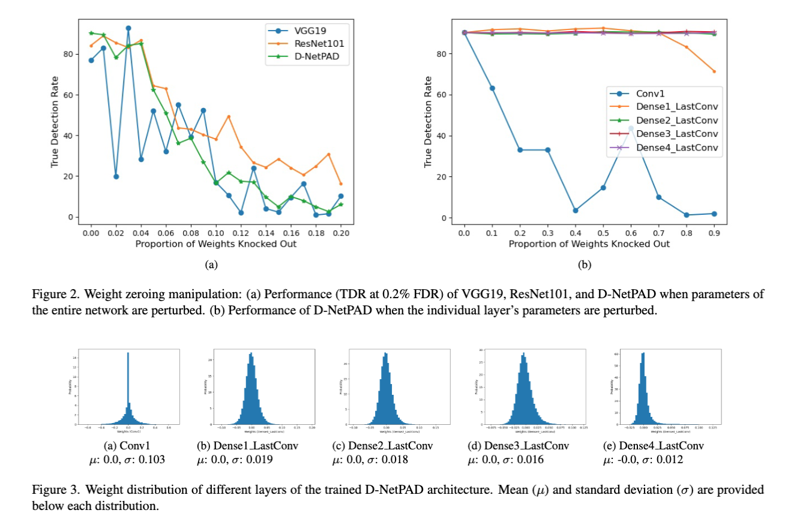

<h2 align="center">
Investigating Weight-Perturbed Deep Neural Networks With Application in Iris Presentation Attack Detection
</h2>
<p align="center">
  Renu Sharma, Redwan Sony, Arun Ross<br>
Michigan State University<br>
sharma90, sonymd, rossarun@cse.msu.edu
</p>

## Abstract
Deep neural networks (DNNs) exhibit superior performance in various machine learning tasks, e.g., image classification, biometric recognition, object detection, etc. However, it is essential to analyze their sensitivity to parameter perturbations before deploying them in real-world applications. In this work, we assess the sensitivity of DNNs against perturbations to their weight and bias parameters. The sensitivity analysis involves three state-of-the-art architectures (VGG, ResNet, and DenseNet), three types of parameter perturbations (Gaussian noise, weight zeroing, and weight scaling), and two settings (entire network and layer-wise). We perform experiments in the context of iris presentation attack detection and evaluate on two publicly available datasets: **LivDet-Iris-2017** and **LivDet-Iris-2020**. Based on the sensitivity analysis, we propose improved models simply by perturbing parameters of the network without undergoing training. We further ensemble these perturbed models at the score-level and at the parameter-level to improve the performance over the original model. The ensemble at the parameter-level shows an average improvement of **43.58%** on the LivDet-Iris-2017 dataset and **9.25%** on the LivDet-Iris-2020 dataset.


This is the official repository of the paper **[Investigating Weight-Perturbed Deep Neural Networks With Application in Iris Presentation Attack Detection](tbd.com)** published in [WACV2024 - Workshop on Manipulation, Adversarial, and Presentation Attacks in Biometrics ](https://sites.google.com/view/wacv2024-map-a). 

## Installation
Instructions for setting up the project environment and installing necessary dependencies.

```bash
# Clone the repository
git clone [repository URL](https://github.com/redwankarimsony/WeightPerturbation-MSU)

# Navigate to the project directory
cd WeightPerturbation-MSU

# Install dependencies
pip install -r requirements.txt
```


## Perturb models 100 times
Perturb the models 100 times each for the models and then the models will be stored in Results directory. By default it will store the best performing (perturbed) 20 models.
```bash
# Perturb DenseNet161
python perturb_models_LivDet2020.py -model DenseNet161 -perturbation GaussianNoise -perturbationSetup Entire -nmodels 100 -keep_best 20

# Perturb ResNet101
python perturb_models_LivDet2020.py -model ResNet101 -perturbation GaussianNoise -perturbationSetup Entire -nmodels 100 -keep_best 20

# Perturb VGG16
python perturb_models_LivDet2020.py -model VGG16 -perturbation GaussianNoise -perturbationSetup Entire -nmodels 100 -keep_best 20
```


After all the perturbations are done, you are ready to do the Kernel Fusion and Score fusion of the perturbed model for ensemble. 

```bash
# Fuse the DenseNet161 model
python kernel_fusion.py -model DenseNet161

# Fuse the ResNet101 model
python kernel_fusion.py -model ResNet101

# Fuse the VGG16 model
python kernel_fusion.py -model VGG16
```

## Results





## Acknowledgments
This research is based upon work supported in part by the Office of the Director of National Intelligence (ODNI), Intelligence Advanced Research Projects Activity (IARPA), via IARPA R&D Contract No. 2017-17020200004. The views and conclusions contained herein are those of the authors and should not be interpreted as necessarily rep resenting the official policies, either expressed or implied, of ODNI, IARPA, or the U.S. Government. The U.S. Government is authorized to reproduce and distribute reprints for governmental purposes notwithstanding any copyright annotation therein.


## Citation
Please cite this work with the following bibTeX
```@inproceedings{sharma2024investigating,
  title={Investigating Weight-Perturbed Deep Neural Networks With Application in Iris Presentation Attack Detection},
  author={Sharma, Renu and Sony, Redwan and Ross, Arun},
  booktitle={WACV 2024 - Workshop on Manipulation, Adversarial, and Presentation Attacks in Biometrics},
  year={2024},
  organization={Michigan State University}
}
```

## Article Corresponding Author
[Arun Ross](https://www.egr.msu.edu/people/profile/rossarun)\
[Email](rossarun@cse.msu.edu)

